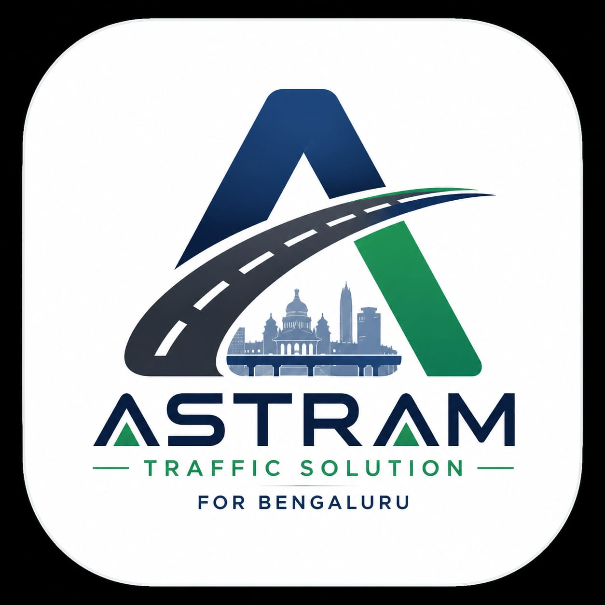

# ASTRAM — Instant Traffic Solution for Bengaluru

<p align="center">
  
</p>

<p align="center">
  <b>AI-powered Event Digital Twin for Bengaluru Traffic Police</b><br/>
  Simulate any road event before it hits the street — risk scoring, resource deployment, AI response plans.
</p>

---

## Table of Contents

- [Overview](#overview)
- [Architecture](#architecture)
- [Tech Stack](#tech-stack)
- [Project Structure](#project-structure)
- [How the Trained Model Works](#how-the-trained-model-works)
- [Risk Engine Logic](#risk-engine-logic)
- [AI Recommendation Pipeline](#ai-recommendation-pipeline)
- [Map & Placement Logic](#map--placement-logic)
- [Local Setup](#local-setup)
- [Environment Variables](#environment-variables)
- [Training the Models](#training-the-models)
- [API Endpoints](#api-endpoints)

---

## Overview

ASTRAM EventTwin is a full-stack traffic management system that creates a **digital twin** of any road event (accident, rally, VIP movement, protest, construction, etc.) using Bengaluru's historical traffic data. It provides:

- **Risk scoring** (0–13 scale) based on event type, similarity to historical events, and nearby hotspot density
- **Resource estimation** — police officers, barricades, and diversion routes needed
- **AI-generated deployment plans** with real Bengaluru road names using Groq/Llama 3.3
- **Smart map placement** — barricades and police posts snapped to actual roads via OSRM
- **Impact metrics** — congestion time, clearance estimates, confidence scores
- **Historical predictions** — what happened in similar events before
- **Downloadable PDF reports and map screenshots**

---

## Architecture

```
┌─────────────────────────────────────────────────────┐
│                    FRONTEND (Vite + React)           │
│  ┌──────────┐  ┌──────────────┐  ┌───────────────┐  │
│  │ Topbar   │  │ SimulationForm│  │ ResultsPanel  │  │
│  │(logo,    │  │(event type,  │  │(risk dial,    │  │
│  │ theme,   │  │ cause,       │  │ resources,    │  │
│  │ health)  │  │ location,    │  │ AI response,  │  │
│  │          │  │ map preview) │  │ map, download)│  │
│  └──────────┘  └──────┬───────┘  └───────┬───────┘  │
│                       │ POST /simulate    │          │
│                       ▼                   │          │
│  ┌──────────────────────────────────────────┐       │
│  │         LeafletMap (OpenStreetMap)        │       │
│  │   E=Event  B=Barricade  P=Police         │       │
│  │   OSRM road-snapping for placement       │       │
│  └──────────────────────────────────────────┘       │
└──────────────────────┬──────────────────────────────┘
                       │ HTTP
                       ▼
┌──────────────────────────────────────────────────────┐
│                 BACKEND (FastAPI + Uvicorn)           │
│                                                      │
│  ┌─────────────────────────────────────────────────┐ │
│  │ simulator.py                                    │ │
│  │  1. Encode event → SentenceTransformer          │ │
│  │  2. Find 5 nearest neighbors (cosine sim)       │ │
│  │  3. Count nearby hotspots                       │ │
│  │  4. Risk Engine → cause-specific scoring        │ │
│  │  5. Groq LLM → structured deployment plan      │ │
│  └──────┬──────────┬───────────┬──────────────────┘ │
│         │          │           │                     │
│  ┌──────▼──┐ ┌─────▼─────┐ ┌──▼──────────────────┐ │
│  │ Models  │ │ Risk      │ │ Groq API            │ │
│  │ .pkl    │ │ Engine    │ │ (Llama 3.3 70B)     │ │
│  │ .npy    │ │ (15+ cause│ │ Structured          │ │
│  │ .csv    │ │  profiles)│ │ deployment plans    │ │
│  └─────────┘ └───────────┘ └─────────────────────┘ │
└──────────────────────────────────────────────────────┘
```

---

## Tech Stack

### Backend
| Technology | Purpose |
|---|---|
| **Python 3.10+** | Runtime |
| **FastAPI** | REST API framework |
| **Uvicorn** | ASGI server |
| **SentenceTransformers** | `all-MiniLM-L6-v2` for event text embeddings |
| **scikit-learn** | `NearestNeighbors` (cosine similarity) for finding similar events |
| **Pandas** | CSV data loading and preprocessing |
| **NumPy** | Embedding matrix operations |
| **Joblib** | Model serialization (.pkl) |
| **Groq SDK** | LLM inference via `llama-3.3-70b-versatile` |

### Frontend
| Technology | Purpose |
|---|---|
| **React 18** | UI framework |
| **Vite 5** | Build tool and dev server |
| **Leaflet.js** | Interactive OpenStreetMap rendering |
| **html2canvas** | Map screenshot export |
| **OSRM API** | Road-snapping for barricade/police placement |
| **CSS Variables** | Dark/light theme system |

### External APIs
| API | Purpose |
|---|---|
| **Groq** (free tier) | AI text generation for deployment plans |
| **OSRM** (free, no key) | Nearest road point snapping |
| **OpenStreetMap** (free) | Map tile rendering |

---

## Project Structure

```
backend (1)/
├── backend/
│   ├── app.py                      # FastAPI app entry point
│   ├── config.py                   # Configuration (paths, env vars)
│   ├── requirements.txt            # Python dependencies
│   ├── .env                        # API keys (GROQ_API_KEY, MAPPLS_*)
│   │
│   ├── data/
│   │   └── Astram_event_data.csv   # 32,000+ historical Bengaluru traffic events
│   │
│   ├── models/
│   │   ├── embeddings.npy          # Pre-computed event embeddings (384-dim)
│   │   ├── similarity_engine.pkl   # Fitted NearestNeighbors model
│   │   ├── hotspots.csv            # Aggregated hotspot density by location
│   │   ├── priority_model.pkl      # Priority classification model
│   │   └── resolution_model.pkl    # Resolution time prediction model
│   │
│   ├── routes/
│   │   └── simulator.py            # Main simulation endpoint logic
│   │
│   ├── training/
│   │   ├── build_embeddings.py     # Generate event text → 384-dim vectors
│   │   ├── build_hotspots.py       # Aggregate hotspot density from raw data
│   │   ├── build_similarity_index.py
│   │   ├── similarity_engine.py    # Build NearestNeighbors index
│   │   ├── train_priority_model.py # Train priority classifier
│   │   ├── train_resolution_model.py
│   │   └── eda.py                  # Exploratory data analysis
│   │
│   └── utils/
│       ├── risk_engine.py          # 15+ cause-specific deployment profiles
│       ├── groq_utils.py           # Groq LLM prompt engineering
│       ├── preprocessing.py        # CSV loading, cleaning, feature extraction
│       ├── feature_engineering.py  # Feature computation for ML models
│       ├── map_utils.py            # Geocoding utilities
│       └── mapmyindia_token.py     # Mappls OAuth token management
│
└── frontend/
    ├── public/
    │   └── logo.jpeg               # ASTRAM brand logo
    ├── src/
    │   ├── App.jsx                 # Main controller, state, API calls
    │   ├── styles.css              # Full design system (dark + light themes)
    │   └── components/
    │       ├── Topbar.jsx          # Logo, health status, theme toggle
    │       ├── SimulationForm.jsx  # Event input form with map preview
    │       ├── ResultsPanel.jsx    # Risk dial, AI response, map, downloads
    │       └── LeafletMap.jsx      # OpenStreetMap with road-snapped markers
    ├── package.json
    └── vite.config.js
```

---

## How the Trained Model Works

### 1. Historical Dataset (`Astram_event_data.csv`)
The system is trained on **32,000+ real Bengaluru traffic events** with fields:
- `event_type` — planned/unplanned
- `event_cause` — accident, rally, construction, VIP movement, etc.
- `description` — free-text event description
- `zone`, `corridor`, `junction` — geographic context
- `police_station` — jurisdiction
- `requires_road_closure` — boolean
- `priority` — urgency level
- `resolution_time_hrs` — how long it took to resolve

### 2. Embedding Generation (`build_embeddings.py`)
Each event is converted to a **384-dimensional vector** using the `all-MiniLM-L6-v2` SentenceTransformer model:

```
Event text = "Event Type: unplanned, Cause: accident, Zone: East,
              Corridor: ORR, Junction: Silk Board, Road Closure: True"
              ↓ SentenceTransformer
              ↓
              [0.042, -0.118, 0.331, ..., 0.087]  (384 dims)
```

All 32,000+ vectors are saved to `models/embeddings.npy` (12.5 MB).

### 3. Similarity Engine (`similarity_engine.py`)
A `NearestNeighbors` model (cosine metric, brute-force algorithm) is fitted on all embeddings. When a new event comes in:

```
New event → encode to 384-dim vector
          → find 5 nearest neighbors in historical data
          → return similarity scores (0.0 to 1.0)
          → extract police_station, priority from matched events
```

### 4. Hotspot Density (`build_hotspots.py`)
Historical events are aggregated by location to compute **hotspot density** — how many past incidents occurred near any given point. High-density areas get higher risk scores.

### 5. Priority & Resolution Models
- `priority_model.pkl` — classifies event urgency (used in risk scoring)
- `resolution_model.pkl` — predicts estimated resolution time

---

## Risk Engine Logic

The risk engine (`utils/risk_engine.py`) uses a **cause-specific profile system** with 15+ event types:

| Event Cause | Strategy | Police Base | Barricade Base | Risk Base |
|---|---|---|---|---|
| Accident | `road_block` | 6 | 4 | 4 |
| Political Rally | `perimeter` | 15 | 10 | 5 |
| Protest | `perimeter` | 20 | 12 | 6 |
| VIP Movement | `corridor` | 10 | 8 | 5 |
| Construction | `lane_closure` | 4 | 6 | 3 |
| Festival | `perimeter` | 12 | 8 | 4 |
| Waterlogging | `road_block` | 4 | 6 | 4 |
| Tree Fall | `road_block` | 4 | 4 | 3 |

### Risk Score Calculation (0–13 scale)
```
risk_score = cause_base_risk
           + similarity_factor (0–3, based on historical match)
           + hotspot_factor (0–3, based on nearby incident density)
           + road_closure_bonus (+2 if road closure requested)
```

Resources are then scaled:
```
police_required    = cause_base × (1 + similarity_factor × 0.5)
barricades_required = cause_base × (1 + risk_score / 13)
```

---

## AI Recommendation Pipeline

The system uses **Groq's Llama 3.3 70B** model to generate structured deployment plans:

1. **System prompt** establishes the AI as a "Senior Traffic Management AI for Bengaluru Traffic Police"
2. **User prompt** includes: event details, risk score, placement strategy description, nearest police station, historical similarity, start/end times, expected crowd
3. **Output format** is enforced as structured bullet points:
   - Risk Level
   - Police Deployment (with road names)
   - Barricade Placement (with road names)
   - Diversion Strategy (road A → road B)
   - Nearby Emergency Services
   - Estimated Impact Duration
   - Short Explanation

---

## Map & Placement Logic

### Strategy-Based Marker Placement
Based on the event cause, the frontend places markers using different strategies:

- **`road_block`** (accidents, tree fall) — 2 barricades at both ends of the road + 1 police post
- **`perimeter`** (rallies, protests, festivals) — 4 barricades at N/E/S/W approach roads + 2 police posts
- **`corridor`** (VIP movement) — 4 barricades at cross-roads + 2 police escort positions
- **`lane_closure`** (construction, breakdown) — 2 barricades + 1 police post

### OSRM Road Snapping
Each marker position is snapped to the nearest actual road using the OSRM `nearest` API. A validation check ensures markers stay within ~200m of the event center (out-of-bound points are retried closer).

---

## Local Setup

### Prerequisites
- **Python 3.10+**
- **Node.js 18+** and npm
- **Groq API key** (free at [console.groq.com](https://console.groq.com))

### 1. Clone / Download the project

### 2. Backend Setup

```bash
cd backend

# Create virtual environment (recommended)
python -m venv venv
venv\Scripts\activate        # Windows
# source venv/bin/activate   # macOS/Linux

# Install dependencies
pip install -r requirements.txt
pip install groq python-dotenv

# Create .env file
echo GROQ_API_KEY=your_groq_api_key_here > .env
```

### 3. Train Models (if models/ is empty)

```bash
# Must run in this order:
python training/build_embeddings.py     # ~2 min, generates embeddings.npy
python training/build_hotspots.py       # generates hotspots.csv
python training/similarity_engine.py    # generates similarity_engine.pkl
python training/train_priority_model.py # generates priority_model.pkl
python training/train_resolution_model.py # generates resolution_model.pkl
```

> **Note:** The pre-trained models are included in `models/`. You only need to retrain if you update `Astram_event_data.csv`.

### 4. Start Backend

```bash
cd backend
python -m uvicorn app:app --reload --host 0.0.0.0 --port 8000
```

Verify: `http://localhost:8000/health` → `{"status": "healthy"}`

### 5. Frontend Setup

```bash
cd frontend

npm install
npm run dev
```

Open: `http://localhost:5173`

---

## Environment Variables

Create `backend/.env`:

```env
GROQ_API_KEY=gsk_xxxxxxxxxxxxxxxxxxxxx
MAPPLS_CLIENT_ID=your_mappls_client_id          # optional
MAPPLS_CLIENT_SECRET=your_mappls_client_secret  # optional
```

| Variable | Required | Purpose |
|---|---|---|
| `GROQ_API_KEY` | **Yes** | AI recommendation generation |
| `MAPPLS_CLIENT_ID` | No | MapMyIndia/Mappls geocoding |
| `MAPPLS_CLIENT_SECRET` | No | MapMyIndia/Mappls geocoding |

---

## API Endpoints

| Method | Endpoint | Description |
|---|---|---|
| `GET` | `/health` | Health check |
| `POST` | `/simulate` | Run a full simulation |
| `POST` | `/detect-zone-corridor` | Detect zone/corridor from location name |

### POST `/simulate` — Request Body

```json
{
  "event_type": "planned",
  "event_cause": "Political Rally",
  "location": "MG Road",
  "geometry_mode": "point",
  "center_lat": 12.9716,
  "center_lng": 77.5946,
  "radius_meters": 500,
  "requires_road_closure": true,
  "start_time": "2025-01-15T10:00",
  "end_time": "2025-01-15T18:00",
  "expected_crowd": 5000
}
```

### POST `/simulate` — Response

```json
{
  "status": "success",
  "risk_level": "HIGH",
  "risk_score": 10,
  "similarity_score": 0.82,
  "confidence_score": 0.85,
  "police_required": 24,
  "barricades_required": 16,
  "diversions": 3,
  "expected_congestion_minutes": 35,
  "estimated_clearance_time": "18:45",
  "hotspots": 847,
  "placement_strategy": "perimeter",
  "placement_description": "Establish a full perimeter...",
  "nearby_police_station": "Cubbon Park PS",
  "recommendation": "* Risk Level: HIGH (10/13)..."
}
```

---

## License

This project is built for the **Bengaluru Traffic Police** as part of the ASTRAM initiative.
